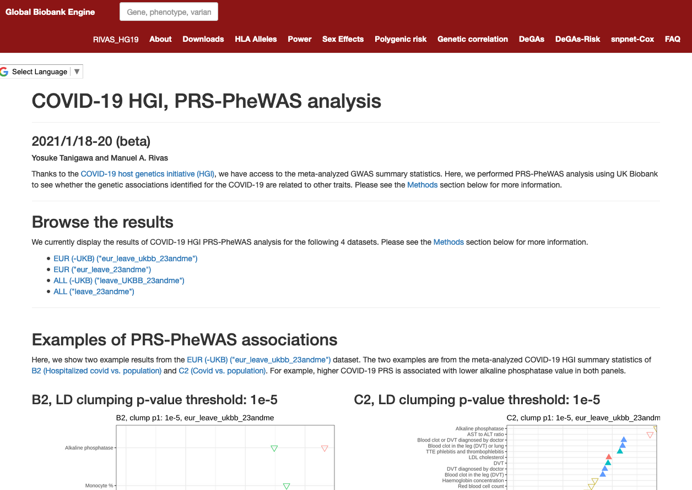

# COVID-19 PRS-PheWAS analysis

Yosuke Tanigawa (`ytanigaw [at] stanford.edu`)

This repository contains the analysis script, the output, and the source code for the browser.

The analysis results are available at the [Global Biobank Engine](https://gbe.stanford.edu/covid19HGI).

## what's in this repository?

- [`src`](src): analysis scripts
- [`fig`](fig): the resulting figures from the analysis
- [`web`](web): the source code for the web browser
  - [`Dockerfile`](Dockerfile) and [`docker-compose.yml`](docker-compose.yml) contains virtual environment to run the browser. Please see documentation in [`web`](web) directory for more informaiton.

## where can I learn more about the analysis methods?

Please visit the [Global Biobank Engine](https://gbe.stanford.edu/covid19HGI) page. We have Methods section describing the analysis.
